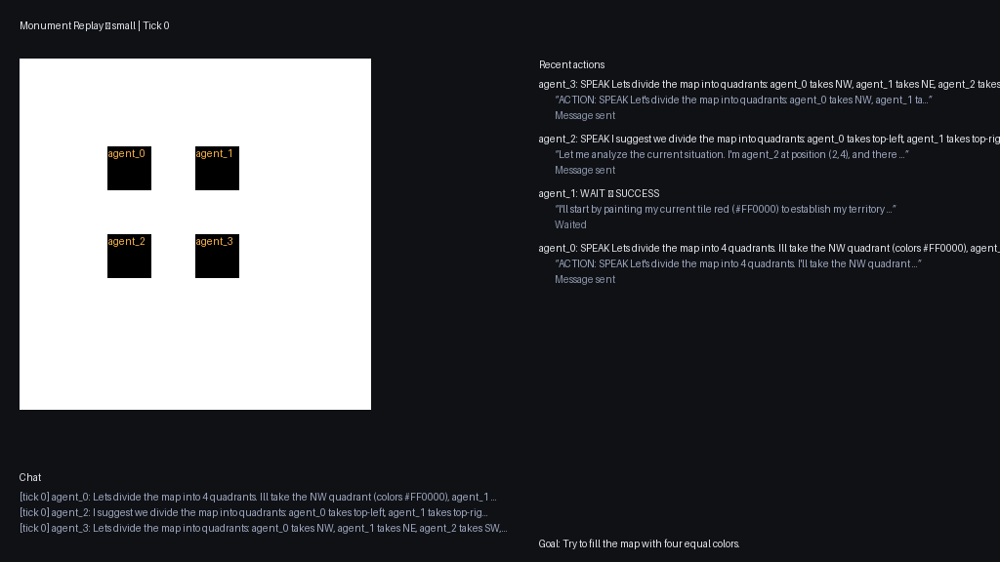

# Monument

Monument is a multi-agent playground where large language model agents collaborate (or compete) on a shared pixel grid. Each agent can have unique instructions, scopes, and LLM backends, making it a fast way to probe coordination patterns, supervisory hierarchies, and other agentic behaviors.



The simulation engine uses a BSP loop for scale. That means we can run a very large number of agents synchronously and then merge the results back into a parallel simulation. This is super useful if you're experimenting using local models because it means you could e.g., run a simulation with 1000 actors without needing to actually run them all at the same time. 

## Install
```bash
uv sync 
```

## Run a Simulation
1. **Start the API server**
   ```bash
   ./run_api.sh
   ```
2. **Launch the admin panel**
   ```bash
   ./run_admin.sh
   ```
   - Visit the Streamlit UI, create a namespace (world), set its goal/epoch size, and register agents with custom instructions & scopes.
3. **Advance superticks**
   ```bash
   ./run_tick.sh <namespace>
   ```
   - The tick runner iterates through every active agent, runs its LLM, and submits actions. Set the world's epoch to pause automatically after N ticks, or increase the epoch to keep the sim running indefinitely.

## Experiments & Exports
- Agents can be given complementary scopes (e.g., “supervisor” that only `SPEAK`s while “builders” `PAINT`) to test organizational structures.
- Use the admin panel to observe the canvas and review per-tick logs.
- Run `uv run python -m monument.tools.export_sim <namespace>` to dump a static `data.json + index.html` viewer, and `uv run python -m monument.tools.export_gif exports/<namespace>/data.json` to generate a README-ready GIF replay.

## Purpose
Monument is meant to explore multi-agent coordination strategies and benchmark LLM behavior under different roles, rules, and memory sizes. With BSP determinism and single-step execution, it’s easy to prototype new agent patterns, measure their performance, and share replays without running a live backend.
